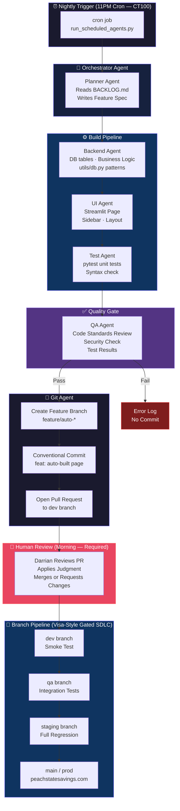

# LinkedIn Post: Autonomous AI SDLC System
**Draft — Darrian Belcher | Product Owner Perspective**
**Date: March 2026**

---

## 📝 POST COPY (LinkedIn-ready — ~2,800 chars)

---

I built a software delivery system that ships production code while I sleep. Here's the architecture and what I learned building it.

When I was at Visa, I watched enterprise teams spend months designing gated SDLC pipelines. Branch protection rules. QA gates. Release versioning. Rollback strategies. All of it designed to protect production from bad code.

I took those same principles home — and then I asked: what if an AI agent ran the whole pipeline?

Here's what I built. 👇

I run a full personal finance platform (Peach State Savings), a sneaker resale operation (SoleOps), and a college prep product (collegeconfused.org) — all on top of my day job at Visa.

I had more product ideas than I had hours in a day. The bottleneck wasn't creativity. It was shipping.

────────────────────────────────

The Architecture (Visa-Inspired, AI-Powered)

I started with the same gated pipeline pattern I learned from Visa:

feature → dev → qa → staging → main (prod)

Every branch has quality gates. Nothing promotes without passing them. Sounds normal. Here's where it gets different:

The overnight orchestrator runs at 11PM every night.

It's a multi-agent pipeline running on my home lab (Proxmox CT100):

🧠 Planner Agent — Reads the backlog, picks the highest-priority unbuilt feature, writes a spec
⚙️ Backend Agent — Builds the data layer, DB tables, business logic
🎨 UI Agent — Builds the Streamlit page, components, sidebar
🧪 Test Agent — Writes pytest unit tests, runs syntax checks
✅ QA Agent — Reviews output, enforces code standards, checks security rules
🚀 Git Agent — Creates the feature branch, commits with conventional commits format, opens a PR

I wake up, review the PR, and if it passes — I merge. That's it.

────────────────────────────────

What Makes This Different from Just Using ChatGPT

Most people prompt an AI and paste code. That's a tool. This is a system.

Guardrails baked in — Every agent knows the code standards. No hardcoded API keys. SQLite/PostgreSQL dual support. Consistent sidebar. These aren't rules I repeat every prompt — they're embedded in the system context.

It knows the codebase — The planner reads the actual backlog file, the actual page structure, the actual DB utils. It's not generating generic code. It's generating my code, in my style.

It fails loudly — If tests don't pass, the Git agent doesn't commit. I wake up to either a clean PR or an error log — not broken prod.

Version controlled like a real team — Conventional commits. Gated branches. Release versioning. Same rigor I'd expect from a 10-engineer team.

────────────────────────────────

The Numbers

📦 73+ pages shipped on peachstatesavings.com
💰 ~$0.50–$2/night in API costs (Claude Opus 4)
⏱️ 6–8 hours of autonomous dev work per overnight run
🏠 Self-hosted on a $0/month home lab (Proxmox + Tailscale + Nginx)

────────────────────────────────

What I Learned from Visa That Made This Work

Enterprise engineering taught me that the pipeline is the product. Most solo devs skip the pipeline because it feels like overhead. But the pipeline is what lets you move fast without breaking things.

The guardrails aren't bureaucracy — they're what let you trust the system.

When your AI agents have the same quality gates a Fortune 500 team uses, you stop worrying about what they shipped last night. You just merge and move on.

────────────────────────────────

Where This Is Going

The next evolution: the planner agent reads user analytics and surfaces the features users are actually asking for — so that when I sit down to review, I'm making better decisions faster.

The system doesn't replace my judgment. It amplifies it.

Product → Backlog → Build → Test → Ship → Analytics → Backlog → ...

A human still drives. The AI handles the road.

────────────────────────────────

If you're a solo builder, indie hacker, or a PM who codes on the side — you don't need a team to ship like one. You need the system.

Drop a comment if you want to see the orchestrator code or the full architecture diagram. Happy to share.

#AI #ProductManagement #SDLC #SoftwareEngineering #BuildInPublic #Streamlit #Automation #SideProject #IndieHacker #Claude

---

## CHARACTER COUNT NOTE
LinkedIn limit: **3,000 characters**
This post: **~2,750 characters** ✅ (safely under limit)

---

## 🏗️ ARCHITECTURE DIAGRAM (Mermaid — Paste into mermaid.live or Notion)



---

## 🖼️ ASCII ARCHITECTURE (for screenshot/image attachment)

```
┌─────────────────────────────────────────────────────────────────────┐
│                    AUTONOMOUS AI SDLC PIPELINE                      │
│                   (Darrian Belcher — Peach State Savings)           │
└─────────────────────────────────────────────────────────────────────┘

  ⏰ 11PM CRON (Home Lab CT100)
           │
           ▼
  ┌─────────────────┐
  │  PLANNER AGENT  │  ← Reads BACKLOG.md → Writes feature spec
  └────────┬────────┘
           │
           ▼
  ┌─────────────────┐
  │  BACKEND AGENT  │  ← DB tables, business logic, db.py patterns
  └────────┬────────┘
           │
           ▼
  ┌─────────────────┐
  │    UI AGENT     │  ← Streamlit page, sidebar, layout
  └────────┬────────┘
           │
           ▼
  ┌─────────────────┐
  │   TEST AGENT    │  ← pytest unit tests, syntax check
  └────────┬────────┘
           │
           ▼
  ┌─────────────────┐
  │    QA AGENT     │  ← Code standards, security, test results
  └────────┬────────┘
           │
      ┌────┴─────┐
    PASS        FAIL
      │           │
      ▼           ▼
  ┌────────┐  ┌─────────┐
  │GIT BOT │  │Error Log│
  │PR → dev│  │No commit│
  └────┬───┘  └─────────┘
       │
       ▼
  👤 HUMAN REVIEW — ALWAYS REQUIRED
  (Darrian applies judgment, merges or revises)
       │
       ▼
  ┌───────────────────────────────────────────┐
  │         GATED BRANCH PIPELINE             │
  │                                           │
  │  feature → dev → qa → staging → main      │
  │                                  │        │
  │                          peachstatesavings.com
  └───────────────────────────────────────────┘

  The system doesn't replace human judgment. It amplifies it.
  ─────────────────────────────────────────────────────────
  ✓ No hardcoded credentials         ✓ Conventional commits
  ✓ SQLite + PostgreSQL dual support  ✓ Branch protection rules
  ✓ Consistent sidebar standard       ✓ Release versioning
  ✓ Tests must pass before commit     ✓ Security scan (bandit)

  COST: ~$0.50–$2/night  |  OUTPUT: 1–2 features/night  |  INFRA: $0/mo (self-hosted)
```

---

## 📋 PRE-PUBLISH CHECKLIST

- [ ] Screenshot of peachstatesavings.com dashboard to attach
- [ ] Screenshot of an overnight GitHub PR to attach
- [ ] Export Mermaid diagram as PNG from mermaid.live
- [ ] Post Tuesday or Wednesday, 7–9AM EST
- [ ] Pin first comment with GitHub repo link

---

## 💡 CAROUSEL OUTLINE (8 slides — alternative format)

Slide 1 — Hook: "I built a system that ships production code while I sleep."
Slide 2 — The Problem: Too many ideas, not enough hours
Slide 3 — The Pipeline: feature → dev → qa → staging → prod
Slide 4 — The 6 Agents: Planner, Backend, UI, Test, QA, Git
Slide 5 — The Guardrails: Baked-in standards, not repeated prompts
Slide 6 — The Numbers: 73+ pages, $0.50–$2/night, self-hosted
Slide 7 — The Visa Lesson: "The pipeline IS the product"
Slide 8 — The Philosophy: "The system doesn't replace my judgment. It amplifies it."
